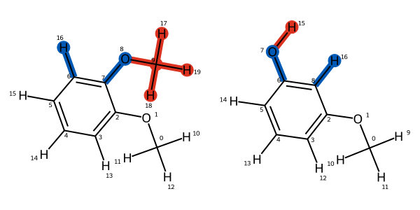
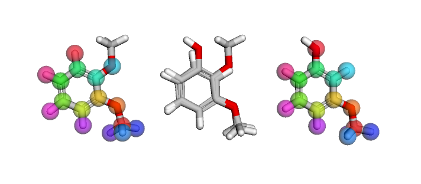

Creating mappings
=================

With your chemical models loaded and defined into two :class:`.ChemicalSystem` objects,
we can now proceed to defining how components in these systems correspond.
``Mapping`` objects are used to defined how ``Component`` objects from different systems are related.
This guide will show how this concept applies to the case of a pair of ligands we wish to transform between.

Generating Mappings
-------------------

Mappings between small molecules are generated by a :class:`.LigandAtomMapper`,
which are reusable classes.
These take pairs of :class:`openfe.SmallMoleculeComponent` objects and suggests zero
(in the case that no mapping can be found) or more mappings.

Built in to the ``openfe`` package are bindings to the `Lomap <https://github.com/OpenFreeEnergy/Lomap>`_ package,
including the :class:`openfe.setup.LomapAtomMapper`
which uses an MCS approach based on the RDKit.
This takes various parameters which control how it produces mappings,
these are viewable through ``help(LomapAtomMapper)``.

This is how we can create a mapping between two ligands: 

.. code::

   import openfe
   from openfe import setup

   # as previously detailed, load a pair of ligands
   m1 = SmallMoleculeComponent(...)
   m2 = SmallMoleculeComponent(...)

   # first create the object which is a mapping producer
   mapper = setup.LomapAtomMapper(threed=True)
   # this gives an iterable of possible mappings, zero or more!
   mapping_gen = mapper.suggest_mappings(m1, m2)
   # all possible mappings can be extracted into a list
   mappings = list(mapping_gen)
   # Lomap always produces a single Mapping, so extract it from the list
   mapping = mappings[0]

The first and second ligand molecules put into the ``suggest_mappings`` method
are then henceforth referred to as ``componentA`` and ``componentB``.
The correspondence of atoms in these two components is then given via the `.componentA_to_componentB` attribute,
which returns a dictionary of integers.
Keys in this dictionary refer to the indices of atoms in the "A" molecule,
while the corresponding values refer to indices of atoms in the "B" molecule.
If a given index does not appear, then it is unmapped.

.. note::
   Like the Component objects, a Mapping object is immutable once created!

Visualising Mappings
--------------------

In an interactive notebook we can view a 2D representation of the mapping.
In this view,
atoms that are deleted are coloured red, while atoms that undergo an elemental transformation are coloured blue.
Similarly, bonds that are deleted are coloured red,
while bonds that change, either bond order or are between different elements,
are coloured blue.

These 2D mappings can be saved to file using the :func:`LigandAtomMapping.draw_to_file` function.

With the ``py3dmol`` package installed,
we can also view the mapping in 3D allowing us to manually inspect the spatial overlap
of the mapping.
In a notebook, this produces an interactive rotatable view of the mapping.
The left and rightmost views show the "A" and "B" molecules
with coloured spheres on each showing the correspondence between atoms.
The centre view shows both molecules overlaid, allowing the spatial correspondence to be directly viewed.

.. code::

   from openfe.utils import visualization_3D

   view = visualization_3D.view_mapping_3d(mapping)

The cartesian distance between pairs of atom mapping is also available via the :meth:`.get_distances()` method.
This returns a numpy array.

.. code::

   mapping.get_distances()

Scoring Mappings
----------------

With many possible mappings,
and many ligand pairs we could form mappings between,
we use **scorers** to rate if a mapping is a good idea.
These take a ``LigandAtomMapping`` object and return a value from 0.0 (indicating a great mapping)
to 1.0 (indicating a terrible mapping).

Again, the scoring functions from Lomap are included in the ``openfe`` package.
The :func:`default_lomap_score` function combines many different criteria together
such as the number of heavy atoms,
if certain chemical changes are present,
and if ring sizes are being mutated,
into a single value.

.. code::

   from openfe.setup.lomap_scorers

   mapping = next(mapper.suggest_mappings(m1, m2))

   score = lomap_scorers.default_lomap_scorer(mapping)

As each scoring function returns a normalised value,
it is possible to chain together various scoring functions,
which is how this ``default_lomap_score`` function is constructed!
