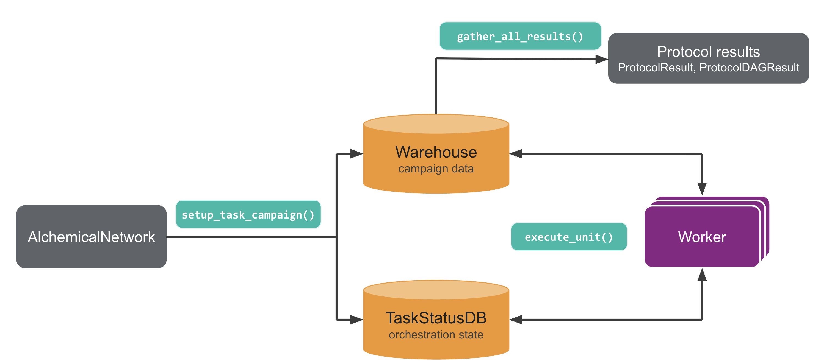

.. _userguide_task_based_execution:

.. module:: openfe
    :noindex:

Task-based Execution
====================

.. warning:: Task-based execution is an experimental feature and subject to change in future releases of openfe.

When using :ref:`quickrun execution <userguide_quickrun>`, you orchestrate the campaign by choosing which ``Transformation`` to run and when to run it.

With task-based execution, **openfe** handles that orchestration for you.
You provide an entire :class:`AlchemicalNetwork`, **openfe** breaks it into dependent tasks, and one or
more :class:`Worker`\s claim those tasks as soon as they are ready to run.

A **task** is a single :class:`ProtocolUnit`, for example the setup, simulation, or
analysis step of one repeat of one :class:`Transformation`.

A task-based campaign uses:

- A **Warehouse**, usually a :class:`storage.FileSystemWarehouse`: a directory with a strict structure that stores the campaign data needed for execution, including the inputs, tasks, and results.
- A :class:`TaskStatusDB`: a SQLite database file that tracks tasks' statuses and dependencies.
- One or more :class:`Worker`\s: The execution objects that claim available tasks, execute them, and write the results to the **Warehouse**. On the CLI they are invoked with ``openfe run-task``, which is equivalent to ``Worker.execute_unit()`` in the Python API.

.. commented out until Protocols and the Execution Model Theory is updated
.. See the :ref:`Protocols and the Execution Model Theory  <userguide_execution_theory>` guide for more details on ProtocolDAGs, ProtocolUnits, and ProtocolUnitResults.

This means that you can execute an entire ``AlchemicalNetwork``\'s campaign just by calling the ``openfe run-task`` command  or ``Worker.execute_unit()`` call iteratively to run each task until the entire campaign is complete, without needing to track specific ``Transformation`` JSON files.

For details on how to run an openfe campaign using task-based execution, see the following tutorials:

- :ref:`CLI task-based execution tutorial <task_based_execution_cli>`
- :ref:`Python API task-based execution tutorial <tutorials/task_based_execution_python_api.nblink>`.
