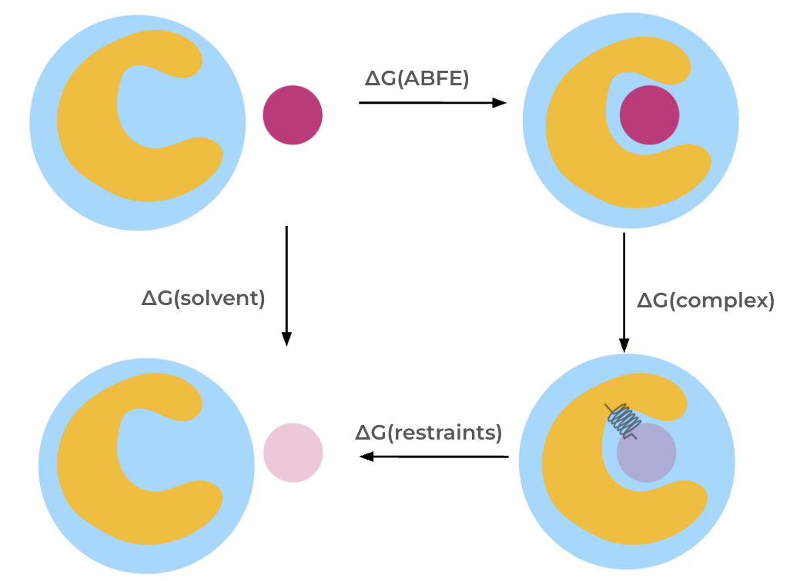

Absolute Binding Protocol
=========================

Overview
--------

The :class:`AbsoluteBindingProtocol <.AbsoluteBindingProtocol>` calculates the absolute binding free energy,
which is the free energy difference between a ligand in solution and the ligand bound to a protein.

The absolute binding free energy is calculated through a thermodynamic cycle.
In this cycle, the interactions of the molecule are decoupled, meaning turned off,
using a partial annihilation scheme (see below) both in the solvent and in the complex phases.

Restraints are required to keep the weakly
coupled and fully decoupled ligand in the binding site region and thereby reduce the phase
space that needs to be sampled. In the :class:`AbsoluteBindingProtocol <.AbsoluteBindingProtocol>`
we apply orientational, or Boresch-style, restraints, as described below.

The absolute binding free energy is then obtained via summation of free energy differences along the thermodynamic cycle.

   Thermodynamic cycle for the absolute binding free energy protocol.

Scientific Details
------------------

Orientational restraints
~~~~~~~~~~~~~~~~~~~~~~~~

Orientational, or Boresch-style, restraints are automaticallly (unless manually specified) applied between three
protein and three ligand atoms using one bond, two angle, and three dihedral restraints.
Reference atoms are picked based on different criteria, such as the root mean squared
fluctuation of the atoms in a short MD simulation, the secondary structure of the protein,
and the distance between atoms, based on heuristics from Baumann et al. [1]_ and Alibay et al. [2]_.
Two strategies for selecting protein atoms are available, either picking atoms that are bonded to each other or that can span multiple residues.
This can be specified using the ``restraint_settings.anchor_finding_strategy`` settings.

Partial annihilation scheme
~~~~~~~~~~~~~~~~~~~~~~~~~~~

In the :class:`.AbsoluteBindingProtocol` the coulombic interactions of the molecule are fully turned off (annihilated).
The Lennard-Jones interactions are instead decoupled, meaning the intermolecular interactions are turned off, keeping the intramolecular Lennard-Jones interactions.

The lambda schedule
~~~~~~~~~~~~~~~~~~~

Molecular interactions are turned off during an alchemical path using a discrete set of lambda windows.
For the transformation in the binding site, the following steps are carried out, starting with the ligand fully interacting in the binding site.

1. Restrain the ligand using orientational restraints.
2. Turn off the electrostatic interactions of the ligand.
3. Decouple Lennard-Jones interactions of the ligand.
4. Release the restraints of the now dummy ligand analytically.

The lambda schedule in the solvent phase is similar to the one in the complex, except that no restraints are applied.
A soft-core potential is applied to the Lennard-Jones potential to avoid instablilites in intermediate lambda windows.
The soft-core potential function from Beutler et al. [3]_ is used by default.
The lambda schedule is defined in the ``lambda_settings`` objects ``lambda_elec``, ``lambda_vdw``, and ``lambda_restraints``.

Simulation overview
~~~~~~~~~~~~~~~~~~~

The :class:`.ProtocolDAG` of the :class:`.AbsoluteBindingProtocol` contains :class:`.ProtocolUnit`\ s from both the complex and solvent transformations.
This means that both legs of the thermodynamic cycle are constructed and run concurrently in the same :class:`.ProtocolDAG`.
This is different from the :class:`.RelativeHybridTopologyProtocol` where the :class:`.ProtocolDAG` only runs a single leg of a thermodynamic cycle.
If multiple ``protocol_repeats`` are run (default: ``protocol_repeats=3``), the :class:`.ProtocolDAG` contains multiple :class:`.ProtocolUnit`\ s of both complex and solvent transformations.

Simulation steps
""""""""""""""""

Each :class:`.ProtocolUnit` (whether complex or solvent) carries out the following steps:

1. Parameterize the system using `OpenMMForceFields <https://github.com/openmm/openmmforcefields>`_ and `Open Force Field <https://github.com/openforcefield/openff-forcefields>`_.
2. Equilibrate the fully interacting system using a short MD simulation using the same approach as the :class:`.PlainMDProtocol` (including rounds of NVT and NPT equilibration).
3. Create an alchemical system.
4. Add orientational restraints to the complex system.
5. Minimize the alchemical system.
6. Equilibrate and production simulate the alchemical system using the chosen multistate sampling method (under NPT conditions).
7. Analyze results for the transformation.

.. note:: Three different types of multistate sampling (i.e. replica swapping between lambda states) methods can be chosen; HREX, SAMS, and independent (no lambda swaps attempted).
          By default the HREX approach is selected, this can be altered using ``solvent_simulation_settings.sampler_method`` or ``complex_simulation_settings.sampler_method`` (default: ``repex``).

Simulation details
""""""""""""""""""

Here are some details of how the simulation is carried out which are not detailed in the :class:`.AbsoluteBindingSettings`:

* The protocol applies a `LangevinMiddleIntegrator <https://openmmtools.readthedocs.io/en/latest/api/generated/openmmtools.mcmc.LangevinDynamicsMove.html>`_ which uses Langevin dynamics, with the LFMiddle discretization [4]_.
* A MonteCarloBarostat is used in the NPT ensemble to maintain constant pressure.

Getting the free energy estimate
~~~~~~~~~~~~~~~~~~~~~~~~~~~~~~~~

The free energy differences are obtained from simulation data using the `MBAR estimator <https://www.alchemistry.org/wiki/Multistate_Bennett_Acceptance_Ratio>`_ (multistate Bennett acceptance ratio estimator) as implemented in the `PyMBAR package <https://pymbar.readthedocs.io/en/master/mbar.html>`_.
Both the MBAR estimates of the two legs of the thermodynamic cycle, and the overall absolute binding free energy (of the entire cycle) are obtained,
which is different compared to the results in the :class:`.RelativeHybridTopologyProtocol` where results from two legs of the thermodynamic cycle are obtained separately.

In addition to the estimates of the free energy changes and their uncertainty, the protocol also returns some metrics to help assess convergence of the results, these are detailed in the :ref:`multistate analysis section <multistate_analysis>`.

See Also
--------

**Setting up AFE calculations**

* :ref:`Defining the Protocol <defining-protocols>`

**Tutorials**

* :any:`Absolute Binding Free Energies tutorial <../../tutorials/abfe_tutorial>`

**Cookbooks**

:ref:`Cookbooks <cookbooks>`

**API Documentation**

* :ref:`OpenMM Absolute Binding Free Energy <afe binding protocol api>`
* :ref:`OpenMM Protocol Settings <openmm protocol settings api>`

References
----------

* `pymbar <https://pymbar.readthedocs.io/en/stable/>`_
* `yank <http://getyank.org/latest/>`_
* `OpenMMTools <https://openmmtools.readthedocs.io/en/stable/>`_
* `OpenMM <https://openmm.org/>`_

.. [1] Broadening the Scope of Binding Free Energy Calculations Using a Separated Topologies Approach, H. Baumann, E. Dybeck, C. McClendon, F. Pickard IV, V. Gapsys, L. Pérez-Benito, D. Hahn, G. Tresadern, A. Mathiowetz, D. Mobley, J. Chem. Theory Comput., 2023, 19, 15, 5058–5076
.. [2] Evaluating the use of absolute binding free energy in the fragment optimisation process, I. Alibay, A. Magarkar, D. Seeliger, P. Biggin, Commun Chem 5, 105 (2022)
.. [3] Avoiding singularities and numerical instabilities in free energy calculations based on molecular simulations, T.C. Beutler, A.E. Mark, R.C. van Schaik, P.R. Greber, and W.F. van Gunsteren, Chem. Phys. Lett., 222 529–539 (1994)
.. [4] Unified Efficient Thermostat Scheme for the Canonical Ensemble with Holonomic or Isokinetic Constraints via Molecular Dynamics, Zhijun Zhang, Xinzijian Liu, Kangyu Yan, Mark E. Tuckerman, and Jian Liu, J. Phys. Chem. A 2019, 123, 28, 6056-6079
