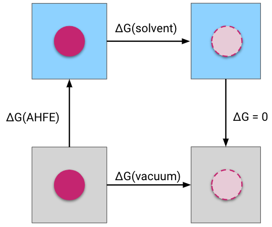

Absolute Solvation Protocol
===========================

Overview
--------

The `absolute solvation protocol <:class:`.AbsoluteSolvationProtocol>` calculates the free energy change 
calculates the free energy change 
associate with transferring a molecule from vacuum into a solvent.

.. note::
   Currently, water is the only supported solvent, however, more solvents might be possible in the future.

The absolute solvation free energy is calculated through a thermodynamic cycle. 
In this cycle, the interactions of the molecule are decoupled, meaning turned off, using a partial annhilation scheme (see below) both in the solvent and in the vacuum phases.
The absolute hydration free energy is then obtained via summation of free energy differences along the thermodynamic cycle.

   Thermodynamic cycle for the absolute solvation free energy protocol.

Scientific Details
------------------

Partial annhilation scheme
~~~~~~~~~~~~~~~~~~~~~~~~~~

In the :class:`.AbsoluteSolvationProtocol` the coulombic interactions of the molecule are fully turned off (annihilated),
while the Lennard-Jones interactions are decoupled, meaning the intermolecular interactions turned off, keeping the intramolecular Lennard-Jones interactions.

The lambda schedule
~~~~~~~~~~~~~~~~~~~

Molecular interactions are turned off during an alchemical path using a discrete set of lambda windows. The electrostatic interactions are turned off first, followed by the decoupling of the van-der-Waals interactions. A soft-core potential is applied to the Lennard-Jones potential to avoid instablilites in intermediate lambda windows. 

.. _Simulation details:

Simulation details
~~~~~~~~~~~~~~~~~~

The protocol applies a LangevinMiddleIntegrator which uses Langevin dynamics, with the LFMiddle discretization [1]_.
Before running the production MD simulation in the NPT ensemble, the protocol performs a minimization of the system, followed by an equilibration in the NPT ensemble. A MonteCarloBarostat is used in the NPT ensemble to maintain constant pressure.

Getting the free energy estimate
~~~~~~~~~~~~~~~~~~~~~~~~~~~~~~~~

The free energy differences are obtained from simulation data using the MBAR estimator (multistate Bennett acceptance ratio estimator).
Both the MABR estimates of the two legs of the thermodynamic cycle, and the overall absolute solvation free energy (of the entire cycle) are obtained,
which is different compared to the results in the :class:`.RelativeHybridTopologyProtocol` where results from two legs of the thermodynamic cycle are obtained separately.
TODO: Link to results page once done

In addition to the estimates of the free energy changes and their uncertainty, the protocol also returns some metrics to help assess convergence of the results. The forward and reverse analysis looks at the time convergence of the free energy estimates. The MABR overlap matrix checks how well lambda states overlap. Since the accuracy of the MBAR estimator depends on sufficient overlap between lambda states, this is a very important metric. 
To assess the mixing of lambda states in the Hamiltonian replica exchange method, the results object returns the replica exchange transition matrix, which can be plotted as the replica exchange overlap matrix, as well as a time series of all replica states. (Todo: link to the results page in case examples of these plots are deposited there) 

Simulation overview
-------------------

The :class:`.ProtocolDAG` of the :class:`.AbsoluteSolvationProtocol` contains both the units from the vacuum and from the solvent transformations. 
This means that both legs of the thermodynamic cycle are constructured and run concurrently in the same :class:`.ProtocolDAG`. This is different from the :class:`RelativeHybridTopologyProtocol` where the :class:`.ProtocolDAG` only runs a single leg of a thermodynamic cycle.
If multiple ``protocol_repeats`` are run (default: ``protocol_repeats=3``), the :class:`.ProtocolDAG` contains multiple units of both vacuum and solvent transformations.

Simulation Steps
""""""""""""""""

Each Protocol simulation Unit (whether vacuum or solvent) carries out the following steps:

1. Parameterize the system using `OpenMMForceFields <https://github.com/openmm/openmmforcefields>`_ and `Open Force Field <https://github.com/openforcefield/openff-forcefields>`_.
2. Equilibrate the fully interacting system using a short MD simulation using the same approach as the :class:`.PlainMDProtocol` (in the solvent leg this will include rounds of NVT and NPT equilibration)
3. Create an alchemical system
4. Minimize the alchemical system
5. Equilibrate and production simulate the alchemical system using the chosen multistate sampling method (under NPT conditions if solvent is present).
6. Analyze results for the transformation

Note: three different types of multistate sampling (i.e. replica swapping between lambda states) methods can be chosen; HREX, SAMS, and independent (no lambda swaps attempted). By default the HREX approach is selected, this can be altered using ``solvent_simulation_settings.sampler_method`` or ``vacuum_simulation_settings.sampler_method`` (default: ``repex``).

See Also
--------

Setting up AFE calculations
~~~~~~~~~~~~~~~~~~~~~~~~~~~

* :ref:`Defining protocol <defining-protocols>`
To be added
.. * :ref:`Setting up AHFE calculations <define-rbfe>`

Tutorials
~~~~~~~~~

<Insert relevant tutorial page, note: see issue 781>

Cookbooks
~~~~~~~~~

:ref:`Cookbooks <cookbooks>`

API Documentation
~~~~~~~~~~~~~~~~~

* :ref:`OpenMM Absolute Solvation Free Energy <afe solvation protocol api>`
* :ref:`OpenMM Protocol Settings <openmm protocol settings api>`

References
----------
* `pymbar <https://pymbar.readthedocs.io/en/stable/>`_
* `yank <http://getyank.org/latest/>`_
* `OpenMMTools <https://openmmtools.readthedocs.io/en/stable/>`_
* `OpenMM <https://openmm.org/>`_

.. [1] Unified Efficient Thermostat Scheme for the Canonical Ensemble with Holonomic or Isokinetic Constraints via Molecular Dynamics, Zhijun Zhang, Xinzijian Liu, Kangyu Yan, Mark E. Tuckerman, and Jian Liu, J. Phys. Chem. A 2019, 123, 28, 6056-6079
