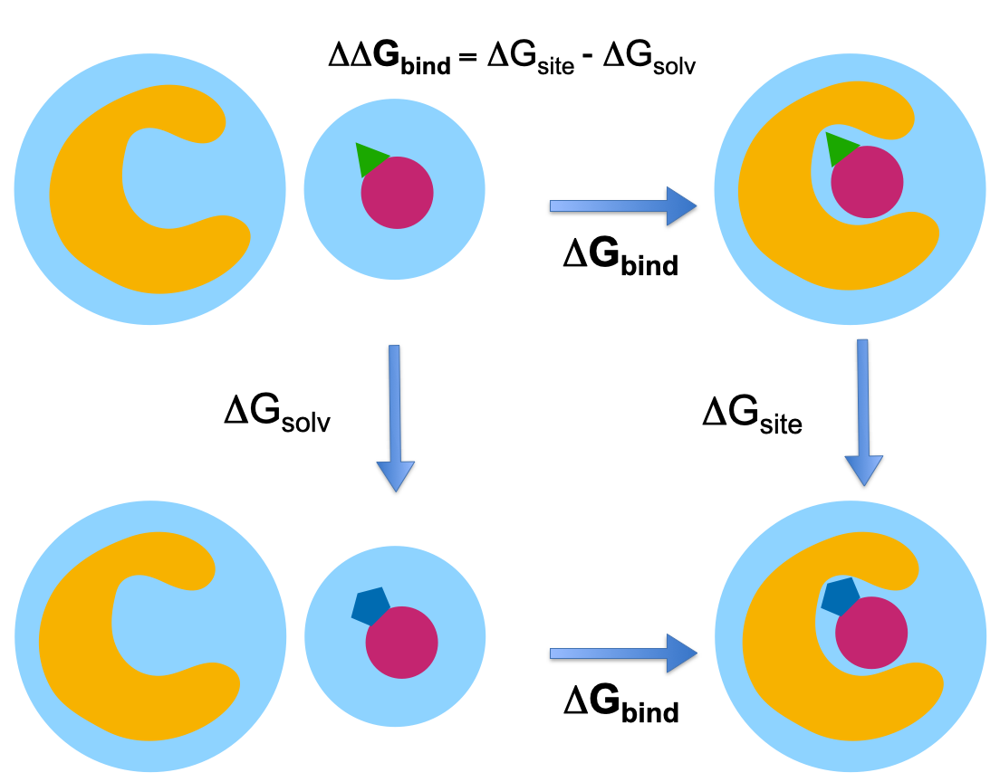

Relative Hybrid Topology Protocol
=================================

Overview
--------

The relative free energy calculation approach calculates the difference in 
free energy between two similar ligands. Depending on the :class:`.ChemicalSystem` 
provided, the protocol either calculates the relative binding free energy 
(RBFE), or the relative hydration free energy (RHFE) 
(see 
.. This is a comment to be replaced :any:`ChemicalSystems, Components and thermodynamic cycles <../setup/chemical_systems_and_thermodynamic_cycles>`
[ToDo: add reference to setup page]). 
In a thermodynamic 
cycle, one ligand is converted into the other ligand by alchemically 
transforming the atoms that vary between the two ligands. The 
transformation is carried out in both environments, meaning both in the 
solvent (ΔG\ :sub:`solv`\) and in the binding site (ΔG\ :sub:`site`\) for RBFE calculations 
and in the solvent (ΔG\ :sub:`solv`\) and vacuum (ΔG\ :sub:`vacuum`\) for RHFE calculations.

.. _label: Thermodynamic cycle for the relative binding free energy protocol

   Thermodynamic cycle for the relative binding free energy protocol.
   
Scientific Details
------------------

This :class:`.RelativeHybridTopologyProtocol` is based off the `Perses implementation <https://perses.readthedocs.io/en/latest/>`_.

The Hybrid Topology approach
~~~~~~~~~~~~~~~~~~~~~~~~~~~~

The :class:`.RelativeHybridTopologyProtocol` uses a hybrid topology approach to represent the two
ligands, meaning that a single set of coordinates is used to represent the
common core of the two ligands while the atoms that differ between the two
ligands are represented separately. An atom map defines which atoms belong
to the core (mapped atoms) and which atoms are unmapped and represented
separately (see :ref:`Creating atom mappings <.. _Creating Atom Mappings:>`. During the alchemical transformation, mapped atoms are switched
from the type in one ligand to the type in the other ligands, while unmapped
atoms are switched on or off, depending on which ligand they belong to.

.. note: In this hybrid topology approach, all bonded interactions between the dummy region and the core region are kept. 
         As pointed out by Fleck et al. [1]_, this can lead to systematic errors if the contribution of the dummy group does not cancel out
         in the thermodynamic cycle (no separability of the partition function). We are currently working on fixing this issue.

The lambda schedule
~~~~~~~~~~~~~~~~~~~

The protocol interpolates molecular interactions between the initial and final state of the perturbation using a discrete set of lambda windows. A function describes how the different lambda components (bonded and nonbonded terms) are interpolated.
Only parameters that differ between state A (``lambda=0``) and state B (``lambda=1``) are interpolated. 
In the default lambda function in the :class:`.RelativeHybridTopologyProtocol`, first the electrostatic interactions of state A are turned off while simulataneously turning on the van-der-Waals interactions of state B. Then, the van-der-Waals interactions of state A are turned off while simulatenously turning on the electrostatic interactions of state B. Bonded interactions are interpolated linearly between ``lambda=0`` and ``lambda=1``. The ``lambda_settings`` ``lambda_functions`` and ``lambda_windows`` define the alchemical pathway. 

Simulation overview
~~~~~~~~~~~~~~~~~~~

The :class:`.ProtocolDAG` of the :class:`.RelativeHybridTopologyProtocol` contains the :class:`.ProtocolUnit`\ s from one leg of the thermodynamic
cycle. 
This means that each :class:`.ProtocolDAG` only runs a single leg of a thermodynamic cycle and therefore two Protocol instances need to be run to get the overall relative free energy difference, DDG. 
If multiple ``protocol_repeats`` are run (default: ``protocol_repeats=3``), the :class:`.ProtocolDAG` contains multiple :class:`.ProtocolUnit`\ s of both vacuum and solvent transformations.

Simulation Steps
""""""""""""""""

Each :class:`.ProtocolUnit` carries out the following steps:

1. Parameterize the system using `OpenMMForceFields <https://github.com/openmm/openmmforcefields>`_ and `Open Force Field <https://github.com/openforcefield/openff-forcefields>`_.
2. Create an alchemical system (hybrid topology)
3. Minimize the alchemical system
4. Equilibrate and production simulate the alchemical system using the chosen multistate sampling method (under NPT conditions if solvent is present).
5. Analyze results for the transformation (for a single leg in the thermodynamic cycle)

Note: three different types of multistate sampling (i.e. replica swapping between lambda states) methods can be chosen; HREX, SAMS, and independent (no lambda swaps attempted). By default the HREX approach is selected, this can be altered using ``simulation_settings.sampler_method`` (default: ``repex``).

Simulation details
""""""""""""""""""

Here are some details of how the simulation is carried out which are not detailed in the :class:`.RelativeHybridTopologySettings`:

* The protocol applies a `LangevinMiddleIntegrator <https://openmmtools.readthedocs.io/en/latest/api/generated/openmmtools.mcmc.LangevinDynamicsMove.html>`_ which uses Langevin dynamics, with the LFMiddle discretization [2]_.
* A MonteCarloBarostat is used in the NPT ensemble to maintain constant pressure.

Getting the free energy estimate
~~~~~~~~~~~~~~~~~~~~~~~~~~~~~~~~

The free energy differences are obtained from simulation data using the MBAR estimator (multistate Bennett acceptance ratio estimator).
In addition to the MBAR estimates of the two legs of the thermodynamic cycle and the overall realtive binding free energy difference,
the protocol also returns some metrics to help assess convergence of the results.
The forward and reverse analysis looks at the time convergence of the free energy estimates.
The MABR overlap matrix checks how well lambda states overlap. Since the accuracy of the MBAR estimator depends on sufficient overlap between lambda states, this is a very important metric.
To assess the mixing of lambda states in the Hamiltonian replica exchange method, the results object returns the replica exchange transition matrix, which can be plotted as the replica exchange overlap matrix, as well as a time series of all replica states. (Todo: link to the results page in case examples of these plots are deposited there)

See Also
--------

**Setting up RFE calculations**

* :ref:`Setting up RBFE calculations <define-rbfe>`
* :ref:`Setting up RHFE calculations <define-rsfe>`

**Tutorials**

* :any:`Relative Free Energies with the OpenFE CLI <../../tutorials/rbfe_cli_tutorial>`
* :any:`Relative Free Energies with the OpenFE Python API <../../tutorials/rbfe_python_tutorial>`

**Cookbooks**

:ref:`Cookbooks <cookbooks>`

**API Documentation**

* :ref:`OpenMM Relative Hybrid Topology Protocol <rfe protocol api>`
* :ref:`OpenMM Protocol Settings <openmm protocol settings api>`

References
----------
* `pymbar <https://pymbar.readthedocs.io/en/stable/>`_
* `perses <https://perses.readthedocs.io/en/latest/>`_
* `OpenMMTools <https://openmmtools.readthedocs.io/en/stable/>`_
* `OpenMM <https://openmm.org/>`_

.. [1] Dummy Atoms in Alchemical Free Energy Calculations, Markus Fleck, Marcus Wieder, and Stefan Boresch, J. Chem. Theory Comput.2021, 17, 4403−4419
.. [2] Unified Efficient Thermostat Scheme for the Canonical Ensemble with Holonomic or Isokinetic Constraints via Molecular Dynamics, Zhijun Zhang, Xinzijian Liu, Kangyu Yan, Mark E. Tuckerman, and Jian Liu, J. Phys. Chem. A 2019, 123, 28, 6056-6079
