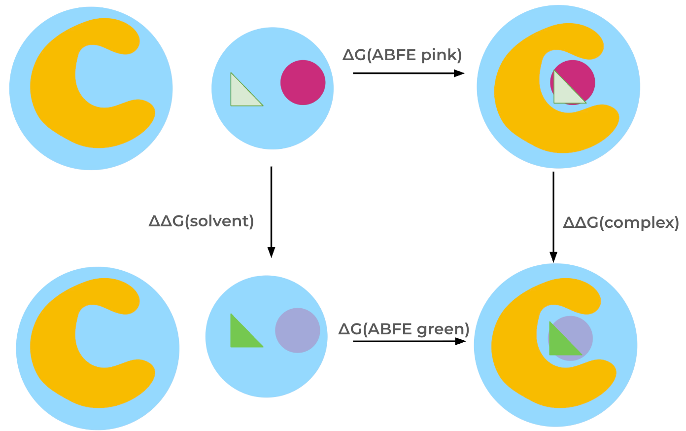

Separated Topologies Protocol
=============================

Overview
--------

The :class:`SepTopProtocol <.SepTopProtocol>` calculates the difference in binding free energy between two ligands.
This protocol essentially performs two absolute binding free energy calculations simultaneously in opposite directions,
by (alchemically) inserting one ligand into the binding site, while removing the other ligand at the same time.
In contrast to the :ref:`RelativeHybridTopologyProtocol <userguide_relative_hybrid_topology_protocol>`, the two ligand topologies are
completely separate (meaning there is no common core), making atom mapping unnecessary and allowing transformations between chemically diverse ligands.

The relative binding free energy is calculated through a thermodynamic cycle by transforming one ligand into the other ligand
both in the solvent and in the binding site.

Restraints are required to keep the weakly
coupled and fully decoupled ligand in the binding site region and thereby reduce the phase
space that needs to be sampled. In the :class:`SepTopProtocol <.SepTopProtocol>`
we apply orientational, or Boresch-style, restraints, as described below.

In this cycle, the interactions of one molecule are turned off while simultaneously turning on interactions of the other molecule both in the solvent and complex phases.
The relative binding free energy is then obtained via summation of free energy differences along the thermodynamic cycle.

   Thermodynamic cycle for the SepTop free energy protocol.

Scientific Details
------------------

Orientational restraints
~~~~~~~~~~~~~~~~~~~~~~~~

Orientational, or Boresch-style, restraints are applied between three protein and three ligand atoms using one bond,
two angle, and three dihedral restraints. Reference atoms are picked based on different criteria, such as the root mean squared
fluctuation of the atoms in a short MD simulation, the secondary structure of the protein, and the distance between atoms, based on heuristics from Baumann et al. [1]_.

Partial annihilation scheme
~~~~~~~~~~~~~~~~~~~~~~~~~~~

In the :class:`SepTopProtocol <.SepTopProtocol>` the coulombic interactions of the molecules are fully turned off (annihilated) in the respective non-interacting end states.
The Lennard-Jones interactions are instead decoupled, meaning the intermolecular interactions turned off, keeping the intramolecular Lennard-Jones interactions.

The lambda schedule
~~~~~~~~~~~~~~~~~~~

Molecular interactions are modified during an alchemical path using a discrete set of lambda windows.
For the transformation of ligand A to ligand B in the binding site, the following steps are carried out, starting with ligand A being fully interacting in the binding site while ligand B is decoupled.

1. Insert the non-interacting dummy ligand B into the binding site and restrain it using orientational restraints. The contribution of the restraints is calculated analytically.
2. Turn on the van der Waals (vdW) interactions of ligand B while also turning on orientational restraints on ligand A.
3. Turn on the electrostatic interactions of ligand B while at the same time turning off the electrostatics of ligand A.
4. Turn off vdW interactions of ligand A while simultaneously releasing restraints on ligand B.
5. Release the restraints of the now dummy ligand A analytically and transfer the ligand into the solvent.

The lambda schedule in the solvent phase is similar to the one in the complex, except that a single harmonic distance restraint is
applied between the two ligands.
A soft-core potential from Beutler et al. [2]_ is applied to the Lennard-Jones potential to avoid instablilites in intermediate lambda windows.
The lambda schedule is defined in the ``lambda_settings`` objects ``lambda_elec_A``, ``lambda_elec_B``,  ``lambda_vdw_A``, ``lambda_vdw_B``,
``lambda_restraints_A``, and ``lambda_restraints_B``.

Simulation overview
~~~~~~~~~~~~~~~~~~~

The :class:`.ProtocolDAG` of the :class:`SepTopProtocol <.SepTopProtocol>` contains :class:`.ProtocolUnit`\ s from both the complex and solvent transformations.
This means that both legs of the thermodynamic cycle are constructed and run sequentially in the same :class:`.ProtocolDAG`. This is different from the :class:`.RelativeHybridTopologyProtocol` where the :class:`.ProtocolDAG` only runs a single leg of a thermodynamic cycle.
If multiple ``protocol_repeats`` are run (default: ``protocol_repeats=1``), the :class:`.ProtocolDAG` contains multiple :class:`.ProtocolUnit`\ s of both complex and solvent transformations.

Simulation steps
""""""""""""""""

Each :class:`.ProtocolUnit` (whether complex or solvent) carries out the following steps:

1. Parameterize the system using `OpenMMForceFields <https://github.com/openmm/openmmforcefields>`_ and `Open Force Field <https://github.com/openforcefield/openff-forcefields>`_.
2. Equilibrate the fully interacting system using a short MD simulation using the same approach as the :class:`.PlainMDProtocol` (in the solvent leg this will include rounds of NVT and NPT equilibration).
3. Add restraints to the system: Orientational restraints in the complex, a single harmonic distance restraint in the solvent leg.
4. Create an alchemical system.
5. Minimize the alchemical system.
6. Equilibrate and production simulate the alchemical system using the chosen multistate sampling method (under NPT conditions).
7. Analyze results for the transformation.

.. note:: Three different types of multistate sampling (i.e. replica swapping between lambda states) methods can be chosen; HREX, SAMS, and independent (no lambda swaps attempted).
          By default the HREX approach is selected, this can be altered using ``solvent_simulation_settings.sampler_method`` or ``complex_simulation_settings.sampler_method`` (default: ``repex``).

Simulation details
""""""""""""""""""

Here are some details of how the simulation is carried out which are not detailed in the :class:`SepTopProtocol <.SepTopProtocol>`:

* The protocol applies a `LangevinMiddleIntegrator <https://openmmtools.readthedocs.io/en/latest/api/generated/openmmtools.mcmc.LangevinDynamicsMove.html>`_ which uses Langevin dynamics, with the LFMiddle discretization [3]_.
* A MonteCarloBarostat is used in the NPT ensemble to maintain constant pressure.

Getting the free energy estimate
~~~~~~~~~~~~~~~~~~~~~~~~~~~~~~~~

The free energy differences are obtained from simulation data using the `MBAR estimator <https://www.alchemistry.org/wiki/Multistate_Bennett_Acceptance_Ratio>`_ (multistate Bennett acceptance ratio estimator) as implemented in the `PyMBAR package <https://pymbar.readthedocs.io/en/master/mbar.html>`_.
Both the MBAR estimates of the two legs of the thermodynamic cycle, and the overall relative binding free energy (of the entire cycle) are obtained,
which is different compared to the results in the :class:`.RelativeHybridTopologyProtocol` where results from two legs of the thermodynamic cycle are obtained separately.

In addition to the estimates of the free energy changes and their uncertainty, the protocol also returns some metrics to help assess convergence of the results, these are detailed in the :ref:`multistate analysis section <multistate_analysis>`.

See Also
--------

**Tutorials**

* :any:`Separated Topologies Free Energies tutorial <../../tutorials/septop_tutorial>`

**Cookbooks**

:ref:`Cookbooks <cookbooks>`

**API Documentation**

* :ref:`OpenMM Protocol Settings <openmm protocol settings api>`

References
----------

* `pymbar <https://pymbar.readthedocs.io/en/stable/>`_
* `yank <http://getyank.org/latest/>`_
* `OpenMMTools <https://openmmtools.readthedocs.io/en/stable/>`_
* `OpenMM <https://openmm.org/>`_

.. [1] Broadening the Scope of Binding Free Energy Calculations Using a Separated Topologies Approach, H. Baumann, E. Dybeck, C. McClendon, F. Pickard IV, V. Gapsys, L. Pérez-Benito, D. Hahn, G. Tresadern, A. Mathiowetz, D. Mobley, J. Chem. Theory Comput., 2023, 19, 15, 5058–5076
.. [2] Avoiding singularities and numerical instabilities in free energy calculations based on molecular simulations, T.C. Beutler, A.E. Mark, R.C. van Schaik, P.R. Greber, and W.F. van Gunsteren, Chem. Phys. Lett., 222 529–539 (1994)
.. [3] Unified Efficient Thermostat Scheme for the Canonical Ensemble with Holonomic or Isokinetic Constraints via Molecular Dynamics, Zhijun Zhang, Xinzijian Liu, Kangyu Yan, Mark E. Tuckerman, and Jian Liu, J. Phys. Chem. A 2019, 123, 28, 6056-6079
