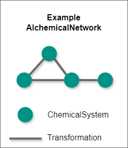

.. _alchemical_network_model:

Alchemical Networks: Planning a Simulation Campaign
===================================================

The goal of the setup stage is to create an :class:`.AlchemicalNetwork`,
which contains all the information needed for a campaign of simulations.
This section will describe the composition of the achemical network,
including the OpenFE objects that define chemistry, as well as
alchemical transformations.

.. TODO provide a written or image based comparison between alchemical and thermodynamic cycles

Like any network, the :class:`.AlchemicalNetwork` can be described in terms
of nodes and edges between nodes. The nodes are :class:`.ChemicalSystem`\ s,
which describe the specific molecules involved. The edges are
:class:`.Transformation` objects, which carry all the information about how
the simulation is to be performed.

In practice, nodes must be associated with a transformation in order to be
relevant in an alchemical network; that is, there are no disconnected nodes.
This means that the alchemical network can be fully described by just the
edges (which contain information on the nodes they connect). Note that this
does not mean that the entire network must be fully connected -- just that
there are no solitary nodes.

Each :class:`.Transformation` represents everything that is needed to
calculate the free energy differences between the two
:class:`.ChemicalSystem`\ s that are the nodes for that edge. In addition to
containing the information for each :class:`.ChemicalSystem`, the
:class:`.Transformation` also contains a :class:`.Protocol` and, when
relevant, atom mapping information for alchemical transformations. The latter
is often done through a :class:`.LigandNetwork`.

.. TODO where to find details on settings

See Also
--------

* :ref:`Alchemical Network API reference <Alchemical Network Planning>`
* :ref:`Chemical Systems UserGuide entry <userguide_chemicalsystems_and_components>`
