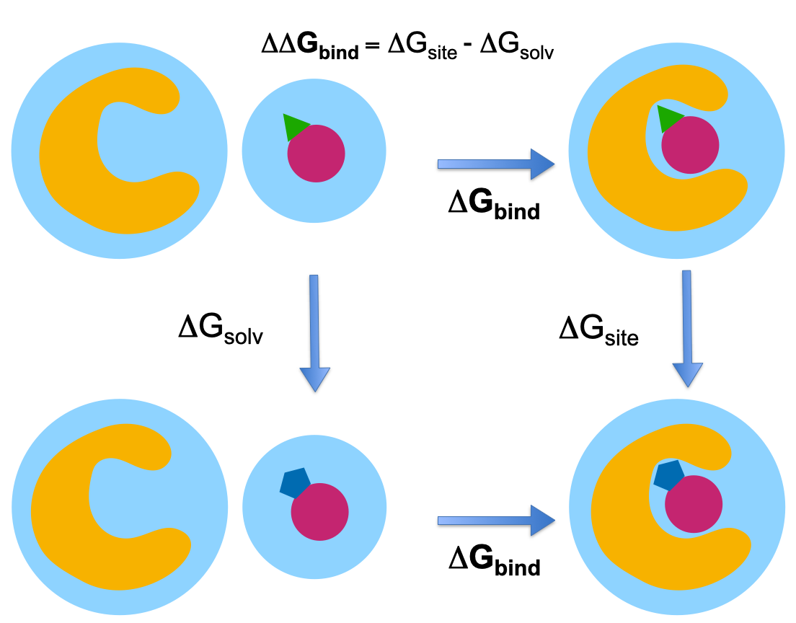

.. _userguide_chemicalsystems_and_components:

Chemical Systems, Components and Thermodynamic Cycles
=====================================================

.. _userguide_chemical_systems:

Chemical Systems
----------------

A :class:`.ChemicalSystem` represents the end state of an alchemical transformation,
which can then be input to a :class:`.Protocol`. 

A :class:`.ChemicalSystem` **does** contain the following information (when present):

* exact atomic information (including protonation state) of protein, ligands, co-factors, and any crystallographic
  waters
* atomic positions of all explicitly defined components such as ligands or proteins
* the abstract definition of the solvation environment, if present

A :class:`.ChemicalSystem` does **NOT** include the following:

* forcefield applied to any component, including details on water model or virtual particles
* thermodynamic conditions (e.g. temperature or pressure)

.. _userguide_components:

Components
----------

A :class:`.ChemicalSystem` is composed of many 'component' objects, which together define overall system.

Examples of components include:

* :class:`.ProteinComponent`: an entire biological assembly, typically the contents of a PDB file.
* :class:`.SmallMoleculeComponent`: typically ligands and cofactors
* :class:`.SolventComponent`: solvent conditions

Splitting the total system into components serves three purposes:

1. alchemical transformations can be easily understood by comparing the differences in components.
2. components can be reused to compose different systems.
3. :class:`.Protocol`\s can have component-specific behavior. E.g. different force fields for each component.

Thermodynamic Cycles
--------------------

We can now describe a thermodynamic cycle as a set of :class:`.ChemicalSystem`\s. 
The exact end states to construct are detailed in the :ref:`pages for each specific Protocol <userguide_protocols>`.

As an example, we can construct the classic relative binding free energy cycle by defining four components: two ligands,
a protein, and a solvent: 

   Illustration of the relative binding free energy thermodynamic cycles and the chemical systems at each end state.

::

  import openfe

  # two small molecules defined in a molfile format
  ligand_A = openfe.SmallMoleculeComponent.from_sdf_file('./ligand_A.sdf')
  ligand_B = openfe.SmallMoleculeComponent.from_sdf_file('./ligand_B.sdf')
  # a complete biological assembly
  protein = openfe.ProteinComponent.from_pdb_file('./protein.pdb')
  # defines an aqueous solvent environment, with a concentration of ions
  solvent = openfe.SolventComponent(smiles='O')

  # ligand_A + protein + solvent
  ligand_A_complex = openfe.ChemicalSystem(components={'ligand': ligand_A, 'protein': protein, 'solvent': solvent})
  # ligand_B + protein + solvent
  ligand_B_complex = openfe.ChemicalSystem(components={'ligand': ligand_B, 'protein': protein, 'solvent': solvent})
  # ligand_A + solvent
  ligand_A_solvent = openfe.ChemicalSystem(components={'ligand': ligand_A, 'solvent': solvent})
  # ligand_A + solvent
  ligand_B_solvent = openfe.ChemicalSystem(components={'ligand': ligand_B, 'solvent': solvent})

See Also
--------

* To see how to construct a :class:`.ChemicalSystem` \s from your files, see :ref:`the cookbook entry on loading molecules <Loading Molecules>`
* For details of what thermodynamic cycles to construct, consult the :ref:`pages for each specific Protocol <userguide_protocols>`
