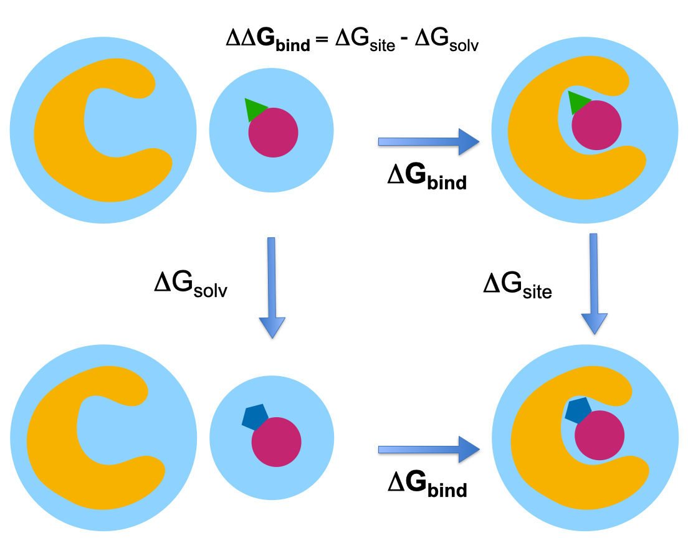

.. _userguide_chemicalsystems_and_components:

Chemical Systems, Components and Thermodynamic Cycles
=====================================================

This page describes the core building blocks used to define simulation states in openfe:
:class:`.Component`\s, which describe what is physically present in a system;
:class:`.ChemicalSystem`\s, which combine components into a complete end state;
and thermodynamic cycles, which connect end states via alchemical transformations.

.. _userguide_components:

Components
----------

Components are the additive, composable building blocks that define the chemical
composition of a simulated system. Splitting a system into components serves three purposes:

1. Alchemical transformations can be easily understood by comparing the differences in components.
2. Components can be reused to compose different systems.
3. :class:`.Protocol`\s can apply component-specific behaviour, e.g. different force fields per component.

Component types — overview
~~~~~~~~~~~~~~~~~~~~~~~~~~

.. list-table::
   :header-rows: 1
   :widths: 25 30 45

   * - Component
     - Role
     - Key notes
   * - :class:`.ProteinComponent`
     - Biological assembly
     - Typically the contents of a PDB file. May include crystallographic waters, ions,
       and disulfide bonds via CONECT records.
   * - :class:`.SmallMoleculeComponent`
     - Ligands and cofactors
     -
   * - :class:`.SolventComponent`
     - Abstract solvent definition
     - Defines solvent conditions and ion concentration. Does **not** include coordinates or box vectors. Solvent is added by the protocol at runtime.
   * - :class:`.SolvatedPDBComponent`
     - Explicitly solvated system
     - Includes atomic coordinates and box vectors. Solvent is already present,
       the protocol does not add any further solvation.
   * - :class:`.ProteinMembraneComponent`
     - Protein-membrane complex
     - Subclass of :class:`.SolvatedPDBComponent`. Includes protein, membrane, solvent,
       and box vectors. Replaces :class:`.ProteinComponent` in membrane systems.

.. _userguide_solvation_models:

Abstract vs explicit solvation
~~~~~~~~~~~~~~~~~~~~~~~~~~~~~~~

These two approaches are **mutually exclusive**:

* **Abstract solvation** — use a :class:`.SolventComponent`. The protocol adds solvent
  during system preparation.
* **Explicit solvation** — use a :class:`.SolvatedPDBComponent` or
  :class:`.ProteinMembraneComponent`. Solvent is already present in the system.

Either define the solvent abstractly, or provide a fully solvated system — do not mix
both for the same leg of a transformation.

.. note::

   Some protocols, such as :class:`.SepTopProtocol` and :class:`.AbsoluteBindingProtocol`,
   use a single :class:`.ChemicalSystem` to represent both the complex and solvent legs.
   In this case, a :class:`.ChemicalSystem` may contain both a :class:`.SolventComponent`
   and a :class:`.ProteinMembraneComponent`. However, these apply to *different* legs: the
   :class:`.SolventComponent` is used only for the solvent leg, and the
   :class:`.ProteinMembraneComponent` (which is already explicitly solvated) is used only
   for the complex leg. The mutual exclusivity rule still holds per leg.

Box vectors for explicitly solvated systems
~~~~~~~~~~~~~~~~~~~~~~~~~~~~~~~~~~~~~~~~~~~

The components :class:`.SolvatedPDBComponent` and :class:`.ProteinMembraneComponent`
requires periodic box vectors. These can be provided in three ways:

1. **CRYST record in the PDB file** — OpenMM reads box vectors automatically.
2. **Manual specification** — box vectors can be provided explicitly in OpenMM format.
3. **Inference from atomic coordinates** — box vectors are estimated from atomic positions.

.. warning::

   Inferring box vectors from atomic positions can be inaccurate if the PDB originates
   from a previous simulation where atoms may be distributed across periodic images.

.. _userguide_chemical_systems:

ChemicalSystem
--------------

A :class:`.ChemicalSystem` is composed of components that together describe the full
simulated system. It represents the **end state** of an alchemical transformation
and is the primary input a :class:`.Protocol` consumes to define a simulation state.

What a ChemicalSystem defines
~~~~~~~~~~~~~~~~~~~~~~~~~~~~~

* Exact atomic information (including protonation state) of protein, ligands,
  cofactors, and any crystallographic waters.
* Atomic positions of all explicitly defined components such as ligands or proteins.
* The abstract or explicit definition of the solvent environment (SolventComponent).

What a ChemicalSystem does NOT define
~~~~~~~~~~~~~~~~~~~~~~~~~~~~~~~~~~~~~~

* Forcefield applied to any component, including water model or virtual particles.
* Thermodynamic conditions (e.g. temperature or pressure).

These are handled by the :class:`.Protocol`.

.. _userguide_system_composition:

System composition examples
---------------------------

The components that make up each :class:`.ChemicalSystem` depend on the protocol and
the nature of the system. The table below summarises the composition for each combination.

.. note::

   Protocol-specific behaviour:
   For :class:`.SepTopProtocol` and :class:`.AbsoluteBindingProtocol`, a single
   :class:`.ChemicalSystem` represents both legs of the thermodynamic cycle. The protocol
   determines internally what is the complex leg and what is the solvent leg.
   This differs from the :class:`.RelativeHybridTopologyProtocol`, where each leg is defined by
   separate :class:`.ChemicalSystem`\s. This behaviour is expected to change in future versions.

.. list-table::
   :header-rows: 1
   :widths: 20 40 40

   * - System
     - RBFE (:class:`.RelativeHybridTopologyProtocol`)
     - SepTop / ABFE (:class:`.SepTopProtocol`, :class:`.AbsoluteBindingProtocol`)
   * - **Standard protein–ligand**
     - | *Complex leg:*
       | :class:`.ProteinComponent` + :class:`.SmallMoleculeComponent`\s + :class:`.SolventComponent`
       |
       | *Solvent leg:*
       | :class:`.SmallMoleculeComponent`\s + :class:`.SolventComponent`
     - | *Single ChemicalSystem (both legs):*
       | :class:`.ProteinComponent` + :class:`.SmallMoleculeComponent`\s + :class:`.SolventComponent`
   * - **Membrane system**
     - | *Complex leg:*
       | :class:`.ProteinMembraneComponent` + :class:`.SmallMoleculeComponent`\s
       | *(no* :class:`.SolventComponent` *— already explicitly solvated)*
       |
       | *Solvent leg:*
       | :class:`.SmallMoleculeComponent`\s + :class:`.SolventComponent`
     - | *Single ChemicalSystem (both legs):*
       | :class:`.ProteinMembraneComponent` + :class:`.SmallMoleculeComponent`\s + :class:`.SolventComponent`
       | *(protocol applies* :class:`.SolventComponent` *only in the solvent leg)*

Thermodynamic Cycles
--------------------

A thermodynamic cycle can be described as a set of :class:`.ChemicalSystem`\s (nodes) connected by
alchemical transformations (edges). The :class:`.Protocol` defines how the
:class:`.ChemicalSystem`\s map onto the cycle and how they are used in practice.

The same :class:`.ChemicalSystem` can be reused across multiple thermodynamic states
depending on the protocol. For details of which end states to construct, consult the
:ref:`pages for each specific Protocol <userguide_protocols>`.

RBFE example
~~~~~~~~~~~~

As an example, the relative binding free energy cycle requires four
:class:`.ChemicalSystem`\s — one for each node in the cycle:

   Illustration of the relative binding free energy thermodynamic cycles and the chemical systems at each end state.

::

  import openfe

  # two small molecules defined in a molfile format
  ligand_A = openfe.SmallMoleculeComponent.from_sdf_file('./ligand_A.sdf')
  ligand_B = openfe.SmallMoleculeComponent.from_sdf_file('./ligand_B.sdf')
  # a complete biological assembly
  protein = openfe.ProteinComponent.from_pdb_file('./protein.pdb')
  # defines an aqueous solvent environment, with a concentration of ions
  solvent = openfe.SolventComponent(smiles='O')

  # ligand_A + protein + solvent
  ligand_A_complex = openfe.ChemicalSystem(components={'ligand': ligand_A, 'protein': protein, 'solvent': solvent})
  # ligand_B + protein + solvent
  ligand_B_complex = openfe.ChemicalSystem(components={'ligand': ligand_B, 'protein': protein, 'solvent': solvent})
  # ligand_A + solvent
  ligand_A_solvent = openfe.ChemicalSystem(components={'ligand': ligand_A, 'solvent': solvent})
  # ligand_B + solvent
  ligand_B_solvent = openfe.ChemicalSystem(components={'ligand': ligand_B, 'solvent': solvent})

Explicitly solvated variant
~~~~~~~~~~~~~~~~~~~~~~~~~~~

When using a :class:`.SolvatedPDBComponent` or :class:`.ProteinMembraneComponent`, replace :class:`.ProteinComponent`
and :class:`.SolventComponent` for the complex leg. No separate :class:`.SolventComponent`
is required:

::

  # explicitly solvated protein-membrane complex (box vectors read from CRYST1 record)
  protein_membrane = openfe.ProteinMembraneComponent.from_pdb_file('./protein_membrane.pdb')

  # ligand_A + explicitly solvated protein-membrane — no SolventComponent needed
  ligand_A_complex = openfe.ChemicalSystem(components={'ligand': ligand_A, 'protein_membrane': protein_membrane})

See Also
--------

* To see how to construct a :class:`.ChemicalSystem` from your files, see :ref:`the cookbook entry on loading molecules <Loading Molecules>`
* For details of which thermodynamic cycles to construct, consult the :ref:`pages for each specific Protocol <userguide_protocols>`
