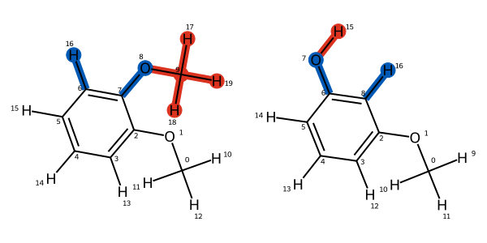
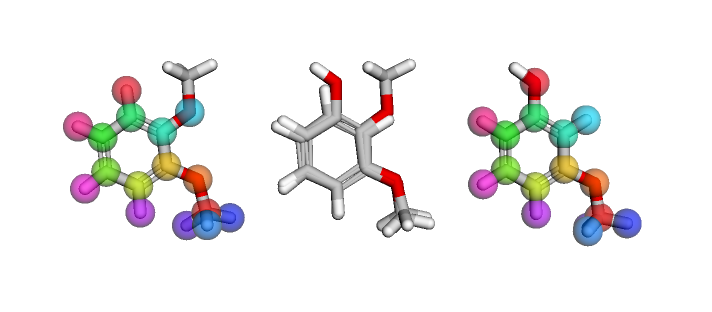

.. _userguide_mappings:
.. _Creating Atom Mappings:

Creating Atom Mappings
======================

``Atom Mapping`` objects are used to define the relationship between
:ref:`components <userguide_components>` from different :class:`.ChemicalSystem`\s.
This guide will show how ``Atom Mappings``  can describe the transformation between a pair of ligands.

Generating Mappings
-------------------

The :class:`.LigandAtomMapper` takes pairs of :class:`openfe.SmallMoleculeComponent`\s and returns zero
(in the case that no mapping can be found) or more possible mappings.

Built in to the ``openfe`` package are bindings to the `Lomap <https://github.com/OpenFreeEnergy/Lomap>`_ package,
including the :class:`.openfe.setup.LomapAtomMapper`, which uses an MCS approach based on RDKit.
.. TODO: insert example output

This is how we can create a mapping between two ligands: 

.. code::

   import openfe
   from openfe import setup

   # as previously detailed, load a pair of ligands
   m1 = SmallMoleculeComponent(...)
   m2 = SmallMoleculeComponent(...)

   # first create an atom mapper
   mapper = setup.LomapAtomMapper(threed=True)
   # this returns an iterable of possible mappings
   mapping_gen = mapper.suggest_mappings(m1, m2)
   # extract all possible mappings into a list
   mappings = list(mapping_gen)
   # Lomap always produces a single Mapping, so extract it from the list
   mapping = mappings[0]

The two molecules passed into the ``suggest_mappings()`` method are then referred to
as ``componentA`` and ``componentB`` (in the above example, ``m1`` is ``componentA``  and  ``m2`` is ``componentB``).

The atom mapping can be accessed through the ``componentA_to_componentB`` attribute, which returns a dictionary 
where keys refer to the indices of atoms in the "A" component, and values refer to indices of atoms in the "B" component.
If a given index does not appear, then it is unmapped.

.. note::
   Like the Component objects, a Mapping object is immutable once created!

Visualising Mappings
--------------------

In an interactive notebook we can view a 2D representation of the mapping.
In this view,
atoms that are deleted are coloured red, while atoms that undergo an elemental transformation are coloured blue.
Similarly, bonds that are deleted are coloured red,
while bonds that change (either bond order change or element change), are coloured blue.

These 2D mappings can be saved to file using the :func:`LigandAtomMapping.draw_to_file()` method.

With the ``py3dmol`` package installed, we can inspect the spatial overlap of the mapping in 3D.
In a notebook, this produces an interactive rotatable view of the mapping.
The left and rightmost views show the "A" and "B" molecules
with coloured spheres on each showing the correspondence between atoms.
The centre view shows both molecules overlaid, allowing the spatial correspondence to be directly viewed.

.. code::

   from openfe.utils import visualization_3D

   view = visualization_3D.view_mapping_3d(mapping)

The cartesian distance between pairs of atom mapping is also available via the :meth:`.get_distances()` method.
This returns a numpy array.

.. code::

   mapping.get_distances()

.. _Scoring Atom Mappings:

Scoring Mappings
----------------

Mapping **scorers** evaluate the quality of an atom mapping and can be used 
as objective functions for optimizing ligand networks.

**Scorers** take a :class:`.LigandAtomMapping` object and return a value from 0.0 (indicating a terrible mapping)
to 1.0 (indicating a great mapping), 
Lomap's scoring functions are included in the ``openfe`` package.
The :func:`default_lomap_score` function combines several criteria
(such as the number of heavy atoms, if certain chemical changes are present,
and if ring sizes are being mutated), into a single value.
It is possible to combine scoring functions in this way because each scoring function returns a normalized value.

.. code::

   from openfe.setup.lomap_scorers

   mapping = next(mapper.suggest_mappings(m1, m2))

   score = lomap_scorers.default_lomap_scorer(mapping)
