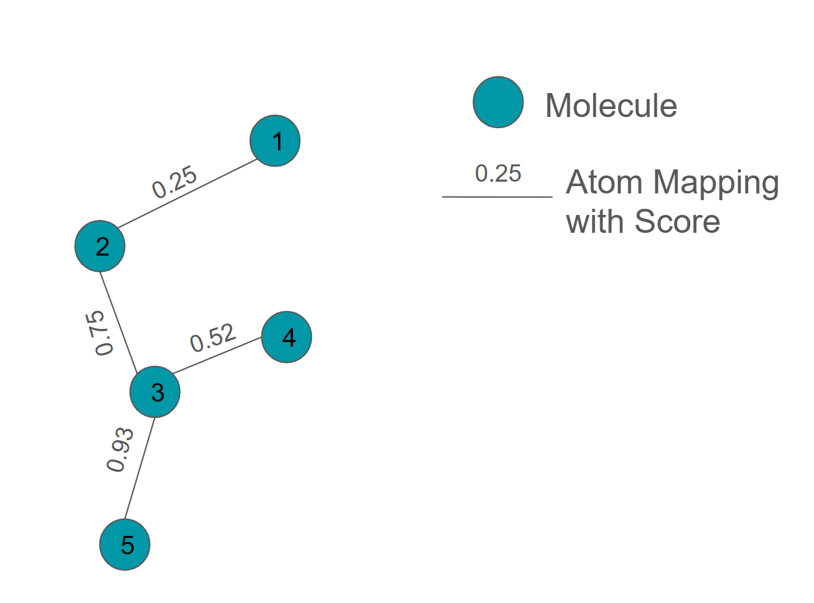

.. _userguide_ligand_network:

Defining the Ligand Network
===========================
A :class:`.LigandNetwork` is a set of connected small molecule ``component``\s, such as a set of drug candidates, 
that can be used to orchestrate free energy calculations and efficiently compute a ligand ranking.

It is of course possible to calculate all possible :class:`.Transformation`\s,  defined as all possible :class:`.AtomMappings`
connecting all :class:`.SmallMoleculeComponent` in a "maximal network" (using :func:`.generate_maximal_network`),
but it is much more efficient to use a network with fewer transformations like a "radial network" (also known as a star map, using :func:`.generate_radial_network`)
or a "minimimal spanning network" (using :func:`.generate_minimal_spanning_network`).

:class:`.LigandNetwork` generation can typically be described as three steps:

   1. Generate the :ref:`Atom Mappings<Creating Atom Mappings>` of all pairwise combinations of ligands.
   2. :ref:`Score <Scoring Atom Mappings>` all generated Atom Mappings.
   3. Build a ``LigandNetwork`` of all possible mappings and their scores.

Generating Ligand Networks
--------------------------

The :class:`.LigandNetwork` can be generated with OpenFE employing a :class:`.LigandAtomMapper` and an atom mapping scorer,
like the :func:`.default_lomap_score` together with a ``LigandNetworkPlanner``, such as :func:`.generate_radial_network`.

In the following code, we will show how a ``LigandNetwork`` can be planned:

.. code::

   import openfe
   from openfe import setup

   # as previously detailed, load a set of ligands
   mols = [SmallMoleculeComponent.from_rdkit(x) for x in rdmols]

   # first let's generate the required objs
   mapper = setup.KartografAtomMapper()
   scorer = setup.lomap_scorers.default_lomap_score
   network_planner =  setup.ligand_network_planning.generate_minimal_spanning_network

   # Now let's plan the Network
   ligand_network = network_planner(ligands=mols, mappers=[mapper], scorer=scorer)

Practical information on generating ligand networks can be found in our :ref:`cookbook for ligand network generation <cookbook/generate_ligand_network.nblink>` .

.. note::
   Like the Component objects, a ``LigandNetwork`` object is immutable once created!
