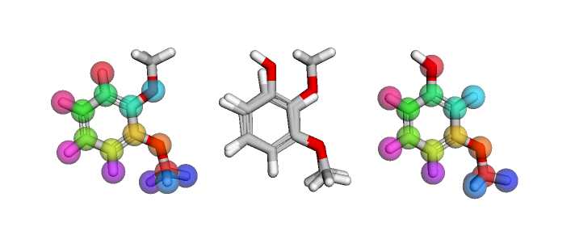

.. _define_ligand_network:

Defining the Ligand Network
===========================

A ligand network is a planning unit that we need to plan how we want to calculaute the final free energy network graph.

Generating Ligand Networks
--------------------------

.. code::

   import openfe
   from openfe import setup

   # as previously detailed, load a pair of ligands
   m1 = SmallMoleculeComponent(...)
   m2 = SmallMoleculeComponent(...)

   # first create the object which is a mapping producer
   mapper = setup.LomapAtomMapper(threed=True)
   # this gives an iterable of possible mappings, zero or more!
   mapping_gen = mapper.suggest_mappings(m1, m2)
   # all possible mappings can be extracted into a list
   mappings = list(mapping_gen)
   # Lomap always produces a single Mapping, so extract it from the list
   mapping = mappings[0]

.. note::
   Like the Component objects, a Mapping object is immutable once created!

Visualising Mappings
--------------------

.. code::

   from openfe.utils import visualization_3D

   view = visualization_3D.view_mapping_3d(mapping)

issue #758