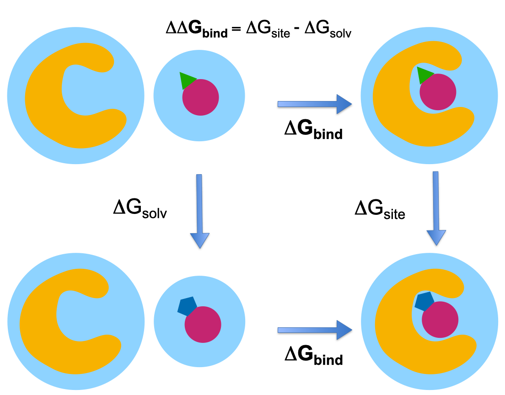

.. _define-rbfe:

Defining RBFE Calculations
==========================

The relative free energy calculation approach calculates the difference in 
potency between two similar ligands. In a thermodynamic cycle, one ligand is 
converted into the other ligand by alchemically transforming the atoms that 
vary between the two ligands, both in the solvent (ΔGsolvent) and in the 
binding site (ΔGsite). 

This RBFE protocol uses a hybrid topology approach to represent the two 
ligands, meaning that a single set of coordinates is used to represent the 
common core of the two ligands while the atoms that differ between the two 
ligands are represented separately. An atom map defines which atoms belong 
to the core (mapped atoms) and which atoms are unmapped and represented 
separately. During the alchemical transformation, mapped atoms are switched 
from the type in one ligand to the type in the other ligands, while unmapped 
atoms are switched on or off, depending on which ligand they belong to.

An :class:`.AlchemicalNetwork` for relative binding free energy calculations
can be easily created with a :class:`.RBFEAlchemicalNetworkPlanner`.

Creating the :class:`.AlchemicalNetwork` basically involves the following
three steps:

1. Creating a :class:`.LigandNetwork` to represent the planned ligand
   transformations.
2. Creating a :class:`.ChemicalSystem` (which combines protein, solvent, and
   ligand) for each ligand.
3. Using the :class:`.LigandNetwork` to create the
   :class:`.AlchemicalNetwork` (where each node is a
   :class:`.ChemicalSystem` and the edges also carry information about the
   :class:`.Protocol`).

Each aspect of this can be performed manually. For details on customizing
the :class:`.LigandNetwork`, see :ref:`define_ligand_network`.
