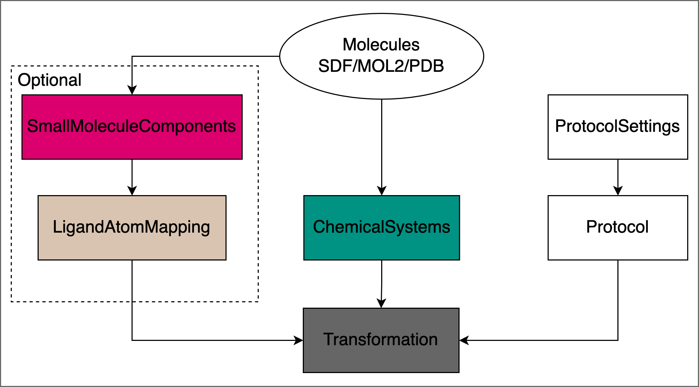
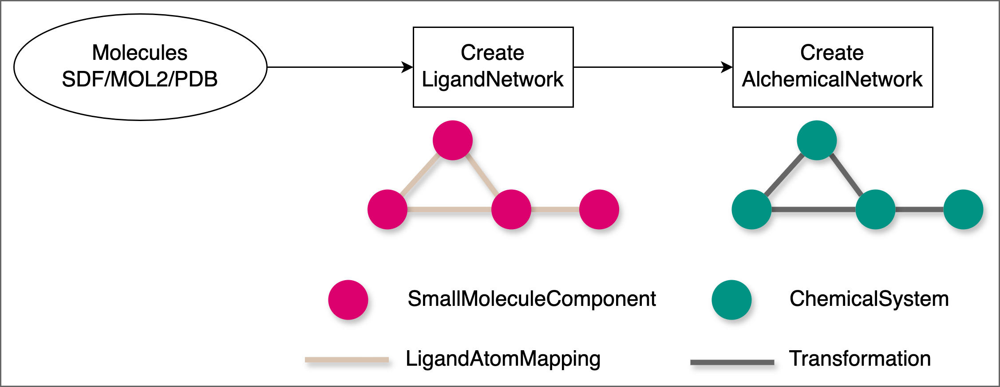

.. _userguide_setup:

Simulation Setup
================

This section provides details on how to set up a free energy calculation or MD simulations.

All protocols in OpenFE follow the same general structure: 

* Reading in input structures and creating :class:`.ChemicalSystem` \s
* Defining the :class:`.Protocol` with specific `ProtocolSettings`.
* Creating :class:`.LigandAtomMapping` \s for relative free energy calculation `Protocols`.

The image below demonstrates how, for relative free energy calculations, you plan a
network of ligand transformations starting from input SDF / MOL2 / PDB files:

The procedure for setting up a simulation depends somewhat on the on the
type of free energy calculation you are running. More detailed
instructions can be found in the following sections:

.. toctree::
   :maxdepth: 1

   chemical_systems_and_thermodynamic_cycles
   creating_atom_mappings_and_scores
   defining_protocols
   creating_ligand_networks
   alchemical_network_model

To set up your alchemical network using the Python interface, but run it using the CLI,
export the network in the same format used by the CLI.
See :ref:`dumping transformations <dumping_transformations>` for more details.
